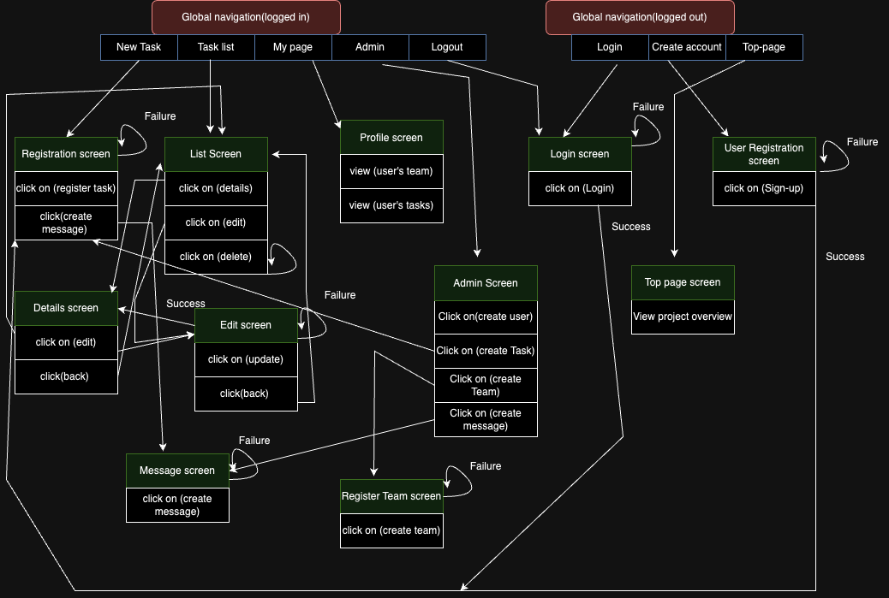

# README

# Langages de développement.
- ruby on rails (6.1.6.1)
- Ruby (3.0.1)

# Execution Procedure
```
git clone git@github.com:username/TrackIt.git
bundle install
rails webpacker:install
rails db:create
rails db:migrate
rails s
```

# Check Sheet, Catalog Design and Table Definition Document


[All links](https://docs.google.com/spreadsheets/d/1Ib-86YodO7JT1gTZuZwRTDgq8llxIU70eoynsaBcQp0/edit?usp=sharing)

## Wireframe


[Wireframe](https://www.figma.com/file/DRHEv3iIi7iDg5MOV4nuo1/TrackIt-Wireframe?type=design&node-id=0%3A1&mode=design&t=RohcBcYmURHJJkw2-1)


# ERD


# SCREEN TRANSITION DIAGRAM

